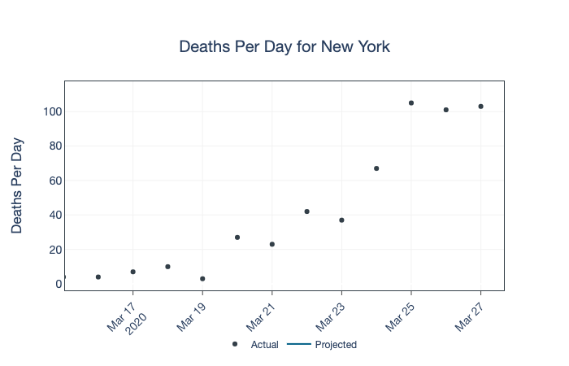
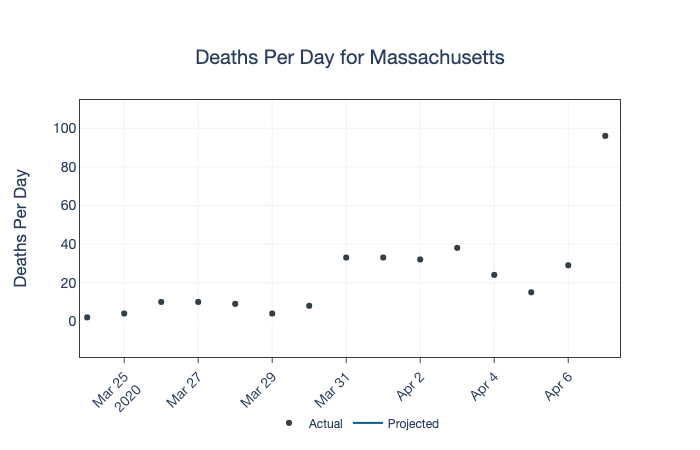
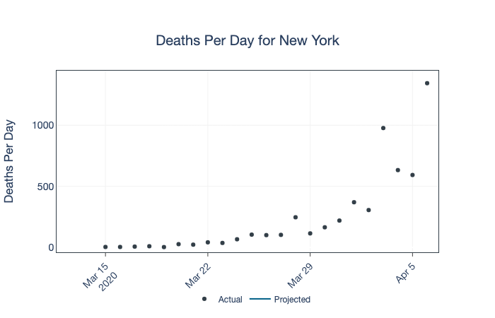
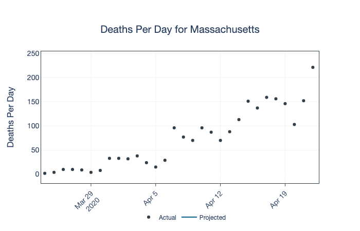
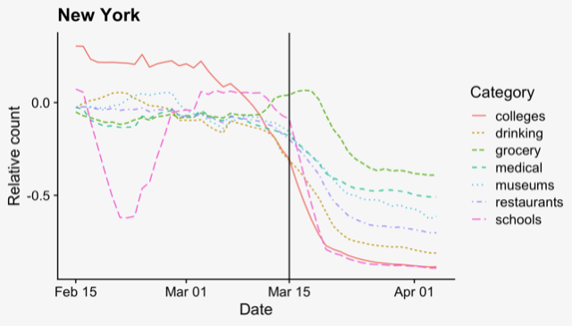
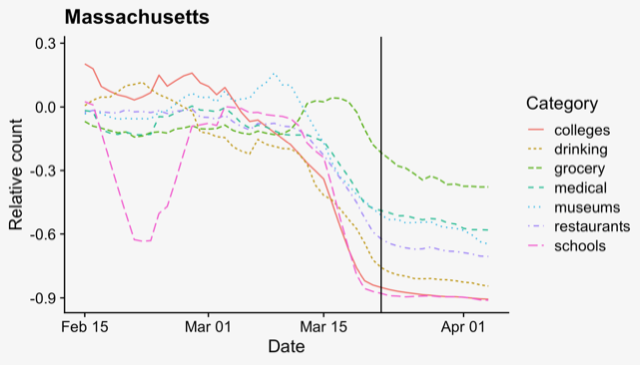

# UT-Austin forecast for COVID-19 mortality in the US

Daily COVID-19 mortality projections at state and national levels from
the [UT-Austin COVID-19 Modeling Consortium][consortium].

## Data source change as of 2020-05-07 TUE

**NOTE**: On May 7, 2020 the New York Times’ made substantial changes
in how it reports COVID-19 deaths, with a large effect on data New
York state in particular.  We are working our way through the
implications of these changes for our model.  In the meantime, we are
using data from Johns Hopkins University, which includes both probable
and confirmed deaths, to inform our projections

## Change credible intervals from 90% to 95%

As of 2020-05-18, we will be reporting 95% credible intervals rather
than 90% credible intervals

## Interactive display with daily updates

[You can see interactive display of our daily forecasts on our website][forecasts]

## Contents

- `forecasts/` contains our latest mortality forecasts for states and
  the US.
- `forecasts/archive/` contains daily snapshot forecasts of mortality
  from past days.
- `ut-mobility-syntax.zip` contains a downloadable .zip file which
  contains our model syntax.  However, we do not have permission to
  share all our data, particularly the social distancing data from
  SafeGraph which we use a model predictors. One might be able to swap
  out the Safegraph data with, for instance, [Apple Maps mobility
  data][applemaps], for instance, but then the forecasts wouldn't line
  up squarely with ours.

## About the model: FAQ

### What does the model do?

We use daily data on COVID-19 deaths, together with mobile-phone data
that allows us to characterize each state's social-distancing
behavior, to form three-week-ahead projections of COVID-19 death rates
in all US states and most major metropolitan areas.

### What data sources do you use?

To train our model, we use daily mortality data aggregated by the [New
York Times][nytimes].  

For each US state, we use local data from mobile-phone GPS traces made
available by [SafeGraph] to quantify the changing impact of
social-distancing measures on "flattening the curve."  SafeGraph is a
data company that aggregates anonymized location data from numerous
applications in order to provide insights about physical places.

An important caveat is that The New York Times data set only reports
confirmed COVID-19 deaths; if this data underestimates _true_ COVID-19
deaths, then our model will, too---probably by a similar amount.

### Can you explain a bit more about how your model works?  What signals are you finding in the data?  

The model works by learning statistical associations between death
rates and the timing/extent of social distancing behavior in each
state.  The data show a clear pattern: states that have been more
successful in flattening the curve seem to be those whose residents
practiced social distancing more aggressively, and further in advance
of when their state's death rate started to rise.  For example, take
the cases of New York and Massachusetts.  New York was seeing about
100 deaths per day on March 27:

Meanwhile, Massachusetts hit about 100 deaths per day on April 7th:

  

But that's where the two states' trajectories diverged signficantly.  New York's death rate shot tragically upward:

While deaths in Massachusetts grew at a much slower pace from that point:

The difference was the timing of social distancing, which we see
clearly in the SafeGraph data.  In New York, distancing behavior
didn't take hold until after death rates had reached 1 per 3 million
people (vertical line in plot below), by which point the epidemic was
already widespread:

The vertical axis shows changes in visitation patterns to various
points of interest (note: the "museums" category also includes parks).
-0.5 is equivalent to a 50% reduction over the January/February
baseline.

In Massachusetts, social distancing began in earnest around the same
time in calendar days as it did in New York: about March 15. However,
the epidemic wasn't as advanced in Massachusetts, where death rates
didn't hit 1 per 3 million residents until a week later, on March 22:

Thus in "epidemic days," if not in actual calendar days, residents of Massachusetts practiced social distancing earlier than residents of New York did.  This seemed to have made all the difference in flattening the curve.  

This example shows you how there's a relationship between the timing and extent of social distancing behavior and the severity of a state's death rate.  Our model learns the quantitative details of that relationship and uses it to extrapolate probable future death rates from currently observed death rates.  

### Can your model tell us what would happen if social-distancing measures were relaxed?

No.  Our model explicitly assumes that social distancing behavior
remains at the levels we've observed over the last seven days of data.
If that doesn't happen, you can throw our model's projections out the
window beyond about ten days in the future.  Why ten days?  Because
that's when we'd expect to see the very first deaths occurring if a
renewed wave of transmisssion started today.  The vast majority of all
deaths that will happen over the next ten days will happen to people
who've already been infected, implying that all the relevant
social-distancing behavior over that time frame has already been
observed.

A bit more detail on this point: our model is a purely statistical "curve-fitting" approach, not an epidemiological model that tries to describe the process of disease transmission itself.  As a result, our model somewhat restricted in the kinds of death-rate curves it can describe.  Empirically, it seems to be effective at describing a single peak in the death rate that has been mitigated, to some degree or another, by social distancing.  But it cannot account for multiple peaks in the death rate driven by distinct waves of COVID-19 transmission.  To predict what would happen across multiple waves of transmission -- the kind of pattern that epidemiologists would expect to see if/when social-distancing measures are relaxed -- you really need a model with an underlying "epidemiological engine," such as the [SEIR models](https://en.wikipedia.org/wiki/Compartmental_models_in_epidemiology) you might have read about.  

### So why don't you use a epidemiological/SIR model instead?

There are tradeoffs, and we think that both types of models have a role to play in working our way through this crisis.  The advantage of our approach is that it does not require estimates of critical epidemiological parameters ("beta," "R0", recovery rate, etc), some of which remain elusive.  The disadvantage, as we've described above, is that it cannot project longer-term epidemiological dynamics beyond the initial wave of mitigated transmission.  For this reason, we do not use the model to make projections beyond a moderate (2-3 week) horizon.

### Why do you model deaths rather than hospitalizations or cases?

Hospitalizations data isn't broadly available, and cases data is confounded by large geographic differences in the availability of testing.  Deaths, while almost surely under-reported to some degree, are generally viewed as being a more reliable data set.

### I've noticed that some of the error bars on your forecasts are pretty wide.  Why is that?

Mostly because future death rates really are uncertain in a lot of areas.  The error bars from our model are going to be wide in any state or city where the available data on deaths, together with the observed timing and extent of social distancing patterns, cannot rule out future growth in the death rate.

There are a couple of other points to consider here.  First, our model does err a bit on the side of conservatism: in a two-week back test, where we fit the model using data through the first week of April and then made predictions for the subsequent two weeks, our model's 95% error bars covered 98% of the notionally "future" data points. 

Second, there are a lot of things our model doesn't "know" about.  In particular, it doesn't use recent data on cases (because the data are difficult to interpret in light of variation in testing availability) or hospitalizations (because the data aren't widely available).  So we'd encourage you to think about our projections as representing a range of plausible scenarios in the absence of any knowledge of recent case/hospitalization trends in your area.  If you know, for example, that hospitalizations in your area have flattened off, then you're likely to see death rates more on the lower end of our error bars.  If hospitalizations are still growing, you're more likely to see death rates on the upper end of (or even beyond) our error bars.  

### Where can I find more details?

We use a Bayesian multilevel negative binomial regression model for the number of deaths each day, and we implement the model in R using the [`rstanarm`][rstanarm] package.  UYou can read all about it in our [technical report].

### Should I be concerned about data privacy?

The mobile phone data comes to us a highly anonymized, aggregated format -- we never see anything at all resembling data from an individual person's mobile phone.  Instead, we see data like: how many mobile devices visited Quack's coffee shop in Austin, TX on each day over the last three months?  We see similar numbers for all cities and most points of interest (restaurants, parks, grocery stores, pharmacies, etc) in a city.  But there's nothing in our data that could "connect the dots" of these visits and link them back to a specific device.   To further enhance privacy, SafeGraph excludes census block group information if
fewer than five devices visited an establishment in a month from a
given census block group. 

[nytimes]: https://github.com/nytimes/covid-19-data
[consortium]: https://covid-19.tacc.utexas.edu/
[SafeGraph]: https://www.safegraph.com/
[forecasts]: https://covid-19.tacc.utexas.edu/projections/
[technical report]: https://covid-19.tacc.utexas.edu/media/filer_public/87/63/87635a46-b060-4b5b-a3a5-1b31ab8e0bc6/ut_covid-19_mortality_forecasting_model_latest.pdf
[rstanarm]: https://mc-stan.org/users/interfaces/rstanarm
[applemaps]: https://www.apple.com/covid19/mobility

